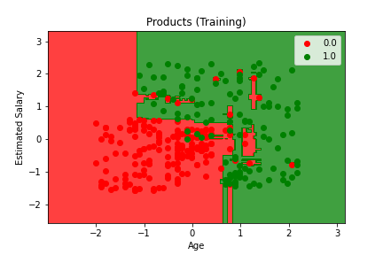
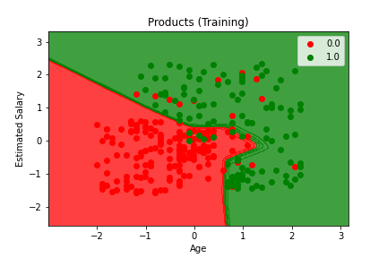
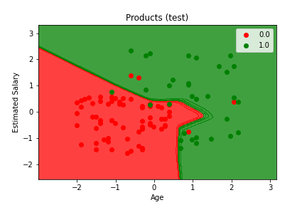

# Random Forest

This is a repo that compares a simple random forest with a simple deep learning model in the same problem, but with different approaches.
The random forest is a very simple model built with Scikit-learn.
The deep learning model is built with PyTorch.
The problem is to predict if a customer of an age and a salary will buy a product.
The data is saved in the products.csv file.

## Using random forest

With 30 estimators and entropy as the split criteria, we will try to predict if a customer will buy a product.

Train results: 99.0% accuracy

Test results: 92.0% accuracy

## Using deep learning

With a simple deep learning model that have 1185 parameters, Adam as optimizer and MSE as error loss, we will try to predict if a customer will buy a product.

Train results: 92.33% accuracy

Test results: 93.00% accuracy

### Conclusions

Comparatively, both approaches train fast and have a fast inference, which is very important for a product recommendation system.
But, clearly, the deep learning model is much more stable and accurate than the random forest.
The random forest overfit the data a lot, as showed in the -7% improve in accuracy from train to test of the random forest vs 0.66% in the deep learning model,
as well as the absolute 1% more of the deep learning model against the random forest in test evaluation.
So, in general, the deep learning model is better suited for classification problems.